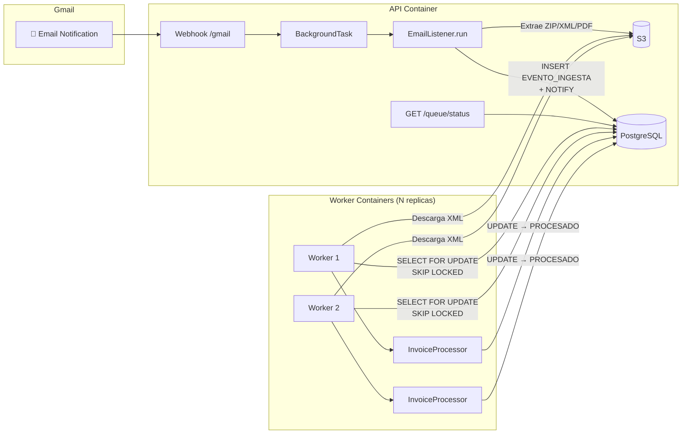

# P2-2: Procesamiento Asíncrono con Colas de Trabajo

## Contexto

El sistema actualmente usa `BackgroundTasks` de FastAPI (thread pool básico) para ejecutar el pipeline completo de ingesta + procesamiento de facturas de forma síncrona y secuencial dentro de un solo hilo. El lineamiento §5.3 del reto exige **"uso de colas de trabajo para procesar múltiples facturas en paralelo"**.

Ya existe un archivo `queue_publisher.py` con una abstracción `QueuePublisher` y una implementación `PostgresQueuePublisher`, pero:
- El publisher solo loguea el evento — **no inserta nada real en una cola**.
- **No existe un worker/consumer** que consuma la cola.
- La tabla `EVENTO_INGESTA` ya funciona como una "cola informal": tiene `ID_ESTADO` (PENDIENTE/EN_PROCESO/PROCESADO/ERROR) e `INTENTOS`.

## ¿Por qué PostgreSQL como cola? (vs Redis/RabbitMQ/Celery)

> [!IMPORTANT]
> **PostgreSQL con `FOR UPDATE SKIP LOCKED` es la mejor opción para este proyecto** por las siguientes razones:

| Criterio | PostgreSQL Queue | Redis Queue / Celery | RabbitMQ |
|---|---|---|---|
| **Costo** | ✅ Gratis — ya está en Docker | ❌ Requiere servicio Redis adicional | ❌ Requiere servicio adicional |
| **Infraestructura** | ✅ Cero componentes nuevos | ⚠️ Nuevo container + dependencia | ⚠️ Nuevo container + dependencia |
| **Transaccionalidad** | ✅ ACID — si el worker falla, el job se libera automáticamente | ❌ At-most-once o requiere ACK manual | ⚠️ ACK manual |
| **Consistencia** | ✅ Cola y datos de factura en la misma BD | ❌ Estado dividido entre Redis y Postgres | ❌ Estado dividido |
| **Complejidad** | ✅ Solo SQL + psycopg (ya instalados) | ⚠️ Nueva librería + configuración | ⚠️ Nueva librería + configuración |
| **Escala esperada** | ✅ Soporta miles de jobs/minuto | Overkill para este volumen | Overkill para este volumen |
| **Recuperación de fallos** | ✅ Rollback automático de transacción | ⚠️ Requiere TTL + retry manual | ⚠️ Dead letter queues |

**El patrón `SELECT ... FOR UPDATE SKIP LOCKED`** (disponible desde PostgreSQL 9.5) convierte cualquier tabla en una cola de trabajo concurrente:
- Múltiples workers pueden reclamar jobs **sin contención** (SKIP LOCKED).
- Si un worker muere, la transacción hace rollback → el job se libera automáticamente.
- La tabla `EVENTO_INGESTA` **ya tiene la estructura necesaria** (estado + intentos).

---

## Decisiones de Arquitectura

1. **Reutilizar tabla `EVENTO_INGESTA` existente**: Se usa esta tabla como cola de trabajo (ya tiene `ID_ESTADO` + `INTENTOS`), en lugar de crear una tabla nueva. Esto mantiene la coherencia con el flujo actual donde `InvoiceProcessor.procesar_pendientes()` ya consulta esta tabla.

2. **Worker como proceso separado**: El worker correrá como un **servicio Docker separado** (usando el mismo Dockerfile pero con `CMD` diferente). Se configurarán `replicas: 2` en Docker Compose para cumplir con el procesamiento paralelo.

3. **Separar ingesta de procesamiento**: `EmailListener.run()` seguirá extrayendo correos a la base de datos (Ingesta), pero la función `_run_ingesta()` dejará de ejecutar el procesamiento de las facturas de manera secuencial. Los workers serán los únicos encargados de dicho procesamiento.

---

## Cambios Propuestos

### Componente 1: Cola de Trabajo con PostgreSQL

#### `modelo_facturacion_gpt.sql`
Agregar un índice parcial para optimizar la consulta `FOR UPDATE SKIP LOCKED` y una columna para rastrear qué worker tomó el job:
```sql
CREATE INDEX CONCURRENTLY IF NOT EXISTS IX_EVENTO_INGESTA_PENDIENTES 
    ON FACTURACION.EVENTO_INGESTA (FECHA_CREACION ASC) 
    WHERE ID_ESTADO = 1;  -- PENDIENTE

ALTER TABLE FACTURACION.EVENTO_INGESTA 
    ADD COLUMN IF NOT EXISTS WORKER_ID VARCHAR(50) NULL;
```

#### `core/python/ingesta/queue_worker.py`
Worker de cola que consume `EVENTO_INGESTA` con el patrón `FOR UPDATE SKIP LOCKED`. Funcionalidades:
1. **Claim atómico**: CTE que selecciona N eventos pendientes y los marca `EN_PROCESO` en una sola operación SQL.
2. **Agrupación por familia**: Reclama todos los miembros de una familia (ZIP → XML + PDF) juntos para evitar procesos parciales.
3. **Procesamiento**: Invoca `InvoiceProcessor._procesar_familia()` con la familia reclamada.
4. **Manejo de fallos**: Si el procesamiento falla, incrementa `INTENTOS` y vuelve a `PENDIENTE` (o `FALLIDO` si supera max reintentos).
5. **Recuperación de stuck jobs**: Al iniciar, resetea jobs que llevan >10 min en `EN_PROCESO` (workers muertos).
6. **Loop con backoff**: Polling con intervalo configurable (default 5s), con backoff exponencial si no hay trabajo.
7. **Graceful shutdown**: Captura `SIGTERM`/`SIGINT` para terminar limpiamente el job actual antes de salir.
8. **Identificación**: Cada worker genera un `WORKER_ID` único para trazabilidad.

#### `core/python/ingesta/queue_publisher.py`
Modificar para que haga `LISTEN/NOTIFY` al insertar un evento:
```python
def publish(self, event: dict, db_conn=None) -> bool:
    if db_conn:
        with db_conn.cursor() as cur:
            cur.execute("NOTIFY factura_nueva")
    return True
```

#### `core/python/ingesta/queue_config.py`
Clase de metadatos con constantes del worker.

#### `config/settings.yaml`
Sección de configuración del worker (`queue_worker`).

### Componente 2: Desacople del Webhook

#### `routers/ingesta.py`
- Modificar `_run_ingesta()` para ejecutar solo la ingesta (sin procesar directamente).
- Agregar `GET /api/webhook/queue/status` para monitorear el estado de la cola.

### Componente 3: Worker como Servicio Docker

#### `docker-compose.yml`
Agregar servicio `worker` reutilizando el contenedor API.

## Diagrama de Arquitectura


